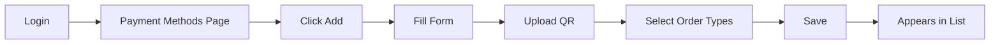
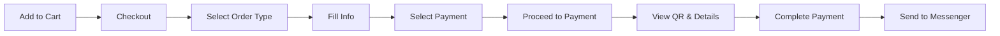
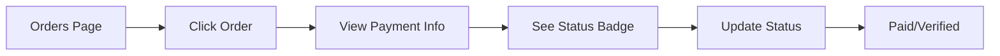

# Payment Methods - Quick Reference Guide

## 🎯 At a Glance

**Status**: ✅ Production Ready  
**Files**: 17 total (8 created, 9 modified)  
**Database Tables**: 2 new + 1 updated  
**Security**: Full RLS protection  
**Integration**: Cloudinary for QR codes

---

## 📋 Quick Links

| Area | Component | Path |
|------|-----------|------|
| **Admin UI** | Payment Methods Management | `/[tenant]/admin/payment-methods` |
| **Customer UI** | Checkout Payment Selection | `/[tenant]/checkout` |
| **Database** | Migration File | `supabase/migrations/0012_payment_methods.sql` |
| **Server Service** | Admin Operations | `src/lib/payment-methods-service.ts` |
| **Client Service** | Customer Operations | `src/lib/payment-methods-client.ts` |
| **Actions** | Server Actions | `src/app/actions/payment-methods.ts` |
| **Form** | Create/Edit Component | `src/components/admin/payment-method-form.tsx` |
| **List** | Admin List Component | `src/components/admin/payment-methods-list.tsx` |

---

## 🚀 Quick Start (3 Steps)

### Step 1: Migration Applied?

Check if migration is already applied:
```sql
SELECT EXISTS (
  SELECT FROM information_schema.tables 
  WHERE table_schema = 'public' 
  AND table_name = 'payment_methods'
);
-- Should return: true
```

If `false`, apply migration:
```bash
# Option A: Using Supabase CLI
supabase db push

# Option B: Copy/paste in Supabase SQL Editor
# File: supabase/migrations/0012_payment_methods.sql
```

### Step 2: Create Your First Payment Method

1. Login as admin
2. Go to **Admin → Payment Methods**
3. Click **"Add Payment Method"**
4. Fill form:
   ```
   Name: GCash
   Details: Send to 09123456789
            Account Name: Ma. Jonina
   QR Code: [Upload from computer]
   Order Types: ☑ Delivery  ☑ Pick Up  ☐ Dine In
   Active: ☑
   ```
5. Click **"Create Payment Method"**

### Step 3: Test It!

1. Open customer menu
2. Add items to cart
3. Go to checkout
4. Select "Delivery"
5. **See payment methods!** ✅
6. Select one
7. Click "Proceed to Payment"
8. See payment details page ✅

---

## 📊 Database Schema (Simplified)

```
payment_methods                    payment_method_order_types
├─ id (uuid)                      ├─ id (uuid)
├─ tenant_id (uuid) ──┐           ├─ payment_method_id (uuid) ──→ payment_methods.id
├─ name (text)        │           └─ order_type_id (uuid) ──────→ order_types.id
├─ details (text)     │
├─ qr_code_url (text) │           orders
├─ is_active (bool)   │           ├─ payment_method_id (uuid)
├─ order_index (int)  │           ├─ payment_method_name (text) ← Snapshot
└─ timestamps         │           ├─ payment_method_details (text) ← Snapshot
                      │           ├─ payment_method_qr_code_url (text) ← Snapshot
                      └───────────└─ payment_status (text) [pending/paid/failed/verified]
```

---

## 🎨 User Flows

### Admin: Create Payment Method



### Customer: Pay for Order



### Admin: Track Payment



---

## 🔑 Key Functions

### Admin Operations

| Function | Purpose | Auth Required |
|----------|---------|---------------|
| `getPaymentMethodsByTenant()` | List all methods | ✅ Admin |
| `createPaymentMethod()` | Create new method | ✅ Admin |
| `updatePaymentMethod()` | Update details | ✅ Admin |
| `updatePaymentMethodOrderTypes()` | Link to order types | ✅ Admin |
| `deletePaymentMethod()` | Delete method | ✅ Admin |
| `reorderPaymentMethods()` | Change display order | ✅ Admin |
| `togglePaymentMethodStatus()` | Enable/disable | ✅ Admin |

### Customer Operations

| Function | Purpose | Auth Required |
|----------|---------|---------------|
| `getPaymentMethodsByOrderTypeClient()` | Get methods for order type | ❌ Public |
| `getActivePaymentMethodsClient()` | Get all active methods | ❌ Public |

---

## 🎨 UI Components

### Admin Components

**Payment Method Form**
- Location: `src/components/admin/payment-method-form.tsx`
- Props: `{ paymentMethod?, orderTypes, tenantId, tenantSlug, onSuccess? }`
- Features: 
  - Name, details, QR upload
  - Order type checkboxes
  - Active toggle
  - Zod validation

**Payment Methods List**
- Location: `src/components/admin/payment-methods-list.tsx`
- Props: `{ paymentMethods, orderTypes, tenantId, tenantSlug, onEdit, onRefresh }`
- Features:
  - Drag-and-drop reorder
  - QR thumbnails
  - Quick enable/disable
  - Edit/delete actions

### Customer Components

**Checkout Page**
- Location: `src/app/[tenant]/checkout/page.tsx`
- Features:
  - Radio button selection
  - Payment details preview
  - QR code viewer
  - Payment details modal
  - Validation

---

## 🔒 Security

### Row Level Security Policies

```sql
-- Payment Methods: Public can read active, admins can write
payment_methods_read_active (SELECT)
payment_methods_write_admin (ALL)

-- Junction Table: Public can read for active, admins can write
payment_method_order_types_read_active (SELECT)
payment_method_order_types_write_admin (ALL)
```

### Admin Verification

All write operations use `verifyTenantAdmin(tenantId)`:
```typescript
await verifyTenantAdmin(tenantId) // Throws if not admin
```

---

## 💡 Common Tasks

### Add New Payment Method

```typescript
// Admin Dashboard → Payment Methods → Add
Name: "PayMaya"
Details: "Account: merchant@paymaya.com"
QR Code: [Upload]
Order Types: [Select applicable]
Active: true
```

### Reorder Payment Methods

```typescript
// Admin Dashboard → Payment Methods
// Drag by grip handle → Drop in new position
// Auto-saves order
```

### Update Payment Status

```typescript
// Admin Dashboard → Orders → Click Order
// Change payment status dropdown
// Select: "Paid"
// Auto-saves
```

### View Payment from Order

```typescript
// Admin Dashboard → Orders → Click Order
// Scroll to payment section
// Click QR code to view full size
```

---

## 🐛 Troubleshooting

### Payment Methods Not Showing at Checkout

**Check 1**: Are methods created?
```sql
SELECT * FROM payment_methods WHERE tenant_id = 'your-uuid';
```

**Check 2**: Are they active?
```sql
SELECT name, is_active FROM payment_methods WHERE tenant_id = 'your-uuid';
```

**Check 3**: Are they linked to order type?
```sql
SELECT pm.name, ot.name as order_type
FROM payment_methods pm
JOIN payment_method_order_types pmot ON pmot.payment_method_id = pm.id
JOIN order_types ot ON ot.id = pmot.order_type_id
WHERE pm.tenant_id = 'your-uuid';
```

### Can't Update Order Types (RLS Error)

**Solution**: Apply RLS fix from `QUICK_FIX_PAYMENT_RLS.md`

```sql
drop policy if exists payment_method_order_types_write_admin 
  on public.payment_method_order_types;
  
-- Then recreate with correct policy
-- (See QUICK_FIX_PAYMENT_RLS.md for full SQL)
```

### QR Code Not Uploading

**Check**: Cloudinary environment variables
```env
NEXT_PUBLIC_CLOUDINARY_CLOUD_NAME=your-cloud-name
```

**Verify**: Image upload component works in other areas (menu items, categories)

---

## 📈 Metrics & Monitoring

### Useful Queries

**Payment Methods per Tenant**
```sql
SELECT 
  t.name as restaurant,
  COUNT(pm.id) as total_methods,
  COUNT(CASE WHEN pm.is_active THEN 1 END) as active_methods
FROM tenants t
LEFT JOIN payment_methods pm ON pm.tenant_id = t.id
GROUP BY t.name
ORDER BY active_methods DESC;
```

**Orders by Payment Method**
```sql
SELECT 
  payment_method_name,
  COUNT(*) as order_count,
  SUM(total) as total_revenue
FROM orders
WHERE payment_method_name IS NOT NULL
GROUP BY payment_method_name
ORDER BY order_count DESC;
```

**Payment Status Distribution**
```sql
SELECT 
  payment_status,
  COUNT(*) as count,
  ROUND(COUNT(*) * 100.0 / SUM(COUNT(*)) OVER (), 2) as percentage
FROM orders
WHERE payment_method_id IS NOT NULL
GROUP BY payment_status;
```

---

## 🎯 Feature Flags

### Payment Methods Optional

System works with **zero payment methods** configured:
- Checkout shows informational message
- Order proceeds without payment selection
- Payment discussed via Messenger
- Admin can add methods later

### Graceful Degradation

- If payment method deleted → Order retains snapshot
- If order type disabled → Payment methods not shown
- If QR missing → Shows text details only

---

## 📱 Mobile Considerations

### Responsive Design

**Checkout Selection**: 
- Radio buttons stack vertically
- QR thumbnails scale down
- Touch-friendly tap targets (44px min)

**Payment Details Modal**:
- Full screen on mobile
- Large QR code (256x256)
- Scrollable content
- Bottom action buttons

**Admin List**:
- Cards stack on mobile
- Drag handle still visible
- Actions accessible

---

## 🔄 Integration Points

### Connected Systems

```
Payment Methods
├─ Order Types (via junction table)
│  └─ Customer Form Fields
├─ Orders (via snapshots)
│  └─ Order Items
├─ Messenger (via message generation)
└─ Cloudinary (for QR uploads)
```

### Data Flow

```
Admin Creates → Database Stores → Customer Selects → Order Captures → Messenger Includes
```

---

## ✅ Testing Checklist

### Admin Tests
- [ ] Create payment method
- [ ] Edit payment method
- [ ] Delete payment method
- [ ] Reorder methods
- [ ] Toggle active status
- [ ] Upload QR code
- [ ] Link to order types
- [ ] View from orders

### Customer Tests
- [ ] See payment methods at checkout
- [ ] Select payment method
- [ ] View payment details preview
- [ ] Open payment details modal
- [ ] View QR code full size
- [ ] Complete order with payment
- [ ] Receive messenger message with payment info

### Edge Cases
- [ ] No payment methods configured
- [ ] Only inactive methods
- [ ] Change order type (methods reload)
- [ ] Payment method deleted after order
- [ ] QR code missing
- [ ] Multiple order types selected

---

## 📚 Documentation Files

| File | Purpose |
|------|---------|
| `PAYMENT_METHODS_COMPREHENSIVE_ANALYSIS.md` | **This file** - Complete system analysis |
| `PAYMENT_METHODS_QUICK_REFERENCE.md` | Quick lookup guide |
| `PAYMENT_METHODS_FINAL_SUMMARY.md` | Feature summary |
| `PAYMENT_FLOW_COMPLETE.md` | User flow walkthrough |
| `PAYMENT_METHODS_IMPLEMENTATION_SUMMARY.md` | Technical details |
| `QUICK_FIX_PAYMENT_RLS.md` | RLS policy fix |

---

## 🎓 Tips & Best Practices

### For Admins
1. Keep payment instructions clear and concise
2. Use high-resolution QR codes (512x512 minimum)
3. Test payment flow before going live
4. Disable unused payment methods instead of deleting
5. Update payment details if account info changes

### For Developers
1. Always use payment snapshots in orders
2. Handle null payment methods gracefully
3. Validate payment selection on server
4. Test RLS policies thoroughly
5. Keep QR uploads optimized

---

*Quick Reference Version: 1.0*  
*Last Updated: November 8, 2025*

