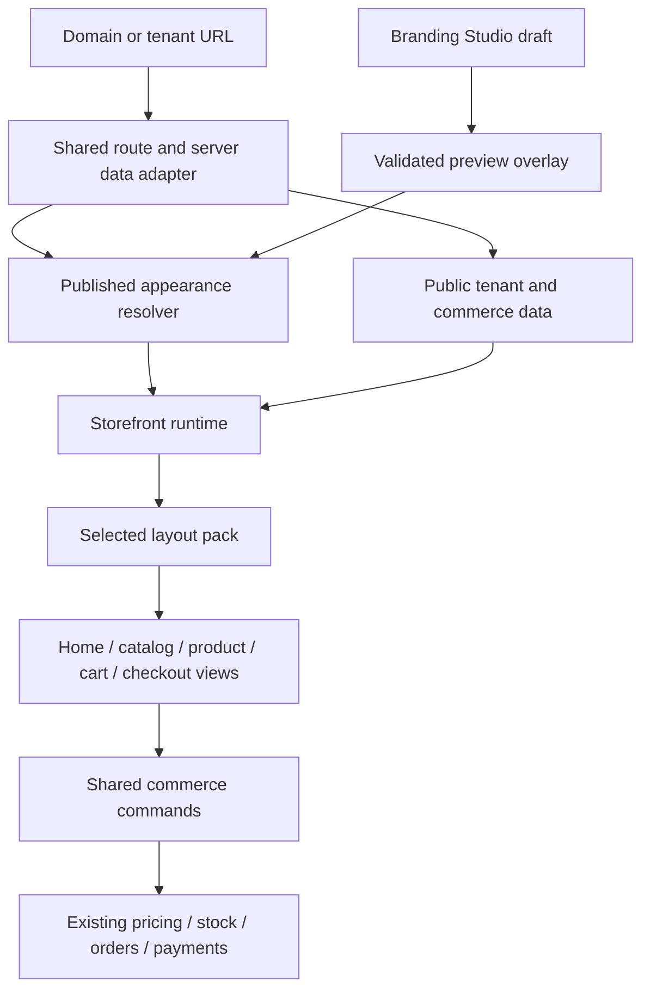

# Storefront Layout Platform Implementation Plan

> **For agentic workers:** Use superpowers:executing-plans to implement this plan task-by-task. Steps use checkbox (`- [ ]`) syntax for tracking. This document is an audit and proposed migration plan; implementation has not started.

**Goal:** Support substantially different storefront experiences, beginning with a BiteSpeed-style storefront, while keeping commerce behavior shared and making future layouts inexpensive to add.

**Architecture:** Introduce registered storefront layout packs above the existing menu/header/card templates. A shared storefront runtime owns tenant context and commerce commands; packs own page composition and presentation. Preserve today's storefront as a legacy adapter and migrate tenants explicitly through preview and publishing.

**Tech Stack:** Existing Next.js 15.5.9 App Router, React 19, TypeScript, Tailwind, Zod, Supabase, Redis, existing Convex order routing, Jest/Testing Library, and Playwright. No framework replacement or additional storefront application is required.

**Audit date:** September 10, 2026. Findings describe the current working tree, including pre-existing uncommitted work. Only this document was added for this task.

---

## 1. Recommendation and scope

Build **developer-authored layout packs with admin customization**. A pack controls the overall storefront shell, homepage, catalog, product presentation, cart presentation, and checkout presentation. Packs may reuse existing views. Administrators select a pack, edit its supported content and styling, preview it, publish it, and switch back.

The authoring preference was asked during the audit; no answer was received before writing this proposal. Developer-authored packs are the working assumption. A no-code builder for arbitrary new layouts would be a separate, larger project, but can later produce content for the same pack interfaces.

| Approach | Advantage | Cost / limitation | Decision |
|---|---|---|---|
| Add more values to `page_layout` | Smallest initial change | Still confined to the existing menu shell; new homepage/navigation/product interactions require edits elsewhere | Keep for variations within the legacy pack |
| Layout packs over shared commerce | Distinct structures with reusable behavior; bounded work to add a design | Requires explicit presentation interfaces and a compatibility migration | Recommended |
| General-purpose visual page builder | Administrators can invent page structures | Requires responsive editing, content schemas, undo/history, accessibility constraints, and commerce integration | Later, if no-code authoring is actually needed |

Success means adding another supported layout normally changes its own folder, a registration entry, its fixtures, and screenshots. It should not require changing menu filtering, pricing, cart persistence, stock validation, order submission, or the database schema. A genuinely new business capability still requires shared domain work.

The first rollout covers the whole customer journey. Product, fulfillment, payment dialogs, confirmation, and tracking may initially use explicitly declared shared presentations. They must be reachable through supported presentation interfaces so subsequent packs can change them without copying their business logic.

## 2. Reference storefront: verified structure and limits

Fetched public HTML for the [BiteSpeed homepage](https://bitespeed.louiedigitalworks.shop/), [menu](https://bitespeed.louiedigitalworks.shop/menu), and [checkout](https://bitespeed.louiedigitalworks.shop/checkout). Browser discovery returned no available browsers. These observations come from markup and responsive classes, not rendered screenshots or a completed transaction.

| Observed reference structure | Required platform support |
|---|---|
| Separate homepage and menu | Pack-level entry-page choice and a real tenant home route |
| Large hero, asymmetric promotion tiles, best-seller row, and explanatory steps | Pack-owned page composition with typed content and product references |
| Homepage desktop navigation and fixed mobile bottom navigation | Replaceable shell/navigation with safe-area and overlay coordination |
| Menu-specific header, search, category filters, responsive product cards | Dedicated catalog view driven by shared catalog state |
| Checkout sections for order, fulfillment/customer details, and summary | Alternate checkout presentation over the existing checkout controller |
| Different typography, surface colors, spacing, and corner styles | Scoped design tokens and pack-local styles |

Favorites and profile controls in the markup announce that those features are coming soon. Do not treat them as verified functionality or automatically add favorites/accounts to this project. Promotional claims, sample ratings, product content, and contact details also are not platform requirements. Use merchant-owned content and existing feature data; an advertised discount must correspond to a real configured offer.

## 3. Audit findings

### A. The existing layout seam is too low in the page — high priority

**Files:** `src/app/[tenant]/menu/menu-client.tsx:77`, `:388`, `:502`, `:581`; `src/components/customer/layouts/index.tsx:9`; `src/app/[tenant]/layout.tsx:49`; `src/app/[tenant]/checkout/page.tsx:32`.

`MenuClient` is 635 lines and assembles tenant setup, outlet rules, search, filtering, bundle adaptation, item selection, headers, hero placement, menu content, cart drawer, product sheet, inspector, and active-order banner. Its layout selector replaces only the content inside an outer `container ... px-4 ...` main element. The tenant layout separately appends the footer; checkout separately fixes confirmation and outlet-summary placement.

**Proposed module:** Storefront runtime plus pack renderer. The runtime exposes a small interface for data, state, and commands; the pack owns the visual shell and composition. Existing views become adapters. This improves locality: changing navigation should require reading the pack, not the checkout implementation.

### B. Commerce behavior is reusable but presentation interfaces expose implementation — high priority

**Files:** `src/hooks/useCheckout.ts:1518`, `:1627`; `src/hooks/useCartView.ts:237`; `src/components/customer/product-detail-content.tsx:711`; `src/components/customer/cart-drawer.tsx:84`.

Cart and checkout already have lazy template registries, which are valuable. Their interfaces are inferred from hook return values, however. The 1,627-line checkout hook exposes roughly 100 return properties, including router, raw state setters, full tenant data, and submission state. Product detail is a 1,524-line module combining markup with modifiers, stock, presell, branch pricing, and upsell continuation.

The cart drawer also repeats edit/remove/upsell/navigation behavior from `useCartView`. The page's checkout command checks store hours (`useCartView.ts:170`); the drawer's entry command (`cart-drawer.tsx:104`) does not do the same check. Final checkout still enforces ordering restrictions. This is evidence of behavior drift, not evidence that an invalid order was accepted.

**Proposed modules:** Shared catalog, product, cart, and checkout controllers with explicit interfaces. Keep pricing, order persistence, and validation implementations; introduce adapters before extracting internals. The leverage comes from one behavior fix benefiting every pack and every cart presentation.

### C. Tenant/session ownership depends on which view mounts — high priority

**Files:** `src/app/layout.tsx:46`; `src/hooks/useCart.tsx:288`, `:632`; `src/app/[tenant]/menu/menu-client.tsx:111`; `src/components/customer/product-detail-content.tsx:534`.

The global cart hydrates a stored tenant context. Menu and product views bind it to their tenant, while cart and checkout independently load their tenant. This requires direct-entry and cross-tenant regression coverage before a new homepage or shell participates in the journey. Existing cart tenant guards and checkout order-type validation must remain intact; this audit did not establish a production data-isolation incident.

**Proposed module:** A tenant storefront runtime that binds identity once, coordinates hydration, and exposes readiness. Product/catalog/checkout mutations wait for the matching tenant context. Styling changes must not reset cart or checkout state.

### D. Appearance is distributed across schemas and data readers — high priority

**Files:** `src/types/database.ts:89`; `src/lib/branding-service.ts:151`, `:312`; `src/lib/branding-registry.ts:242`; `src/lib/queries/tenant-storefront-select.ts:12`; `src/lib/product-detail-data.ts:20`; `src/lib/tenants-client.ts:11`.

Templates and styles live in flat tenant columns, legacy mobile columns, `mobile_overrides`, category settings, hero JSON, and product-detail settings. Menu uses an explicit projection, tenant layout reads a Redis-cached full tenant, and cart/checkout fetch tenant data in the browser. The storefront projection already documents past preview/publish drift when fields were missing.

**Proposed module:** Versioned appearance configuration plus a public storefront data adapter. A new pack's settings belong in its validated document, not new tenant columns. Keep operational features and credentials outside appearance documents. Legacy adapters continue reading current fields until deliberately migrated.

### E. Publishing has multiple consistency seams — high priority

**Files:** `src/components/admin/branding-studio/branding-studio.tsx:298`; `src/app/actions/branding.ts:44`; `src/lib/branding-service.ts:451`; `src/lib/cache.ts:40`, `:212`; `src/lib/redis-cache.ts:28`.

Branding Studio publishes tenant settings, product settings, category order, and category overrides through successive writes. Partial success is possible. `saveBrandingAction` revalidates Next routes, but the reviewed action/write path does not call `invalidateTenantCache`; tenant readers can retain a Redis entry with a 1,800-second TTL. This is a source-level stale-data risk, not a timed production reproduction.

The legacy writer may also report success with skipped layout fields when migrations are missing. That compatibility behavior must not activate a new pack whose configuration was not stored.

**Proposed module:** Atomic appearance publishing with revision conflict detection, explicit cache invalidation, and rollback. Keep catalog editing as a separate operation unless it is intentionally brought into the same transaction. The editor must communicate these outcomes accurately.

### F. Responsive alternatives can interfere with each other — medium/high priority

**Files:** `src/lib/storefront-device-layout.ts:55`; `src/app/[tenant]/menu/menu-client.tsx:511`; `src/components/customer/layouts/index.tsx:93`; `src/components/customer/layouts/layout-sidebar.tsx:100`; `src/hooks/use-branding-preview.ts:34`.

Different mobile/desktop menu choices can mount two trees and hide one with CSS. They share the active category setter. The sidebar selector effect clears an active category even when its tree is hidden; sidebar scrolling also uses document-global category IDs. Duplicate trees therefore create concrete interference paths and potential duplicate IDs/effects. Viewport overrides start desktop-first and update after mount.

**Proposed module:** One runtime, one active interactive presentation, and responsive pack-local CSS. Separate filter-category state from scroll-spy state. Preserve the legacy appearance choices, but remove hidden-tree state mutations and use scoped element references. New packs must not duplicate the full interactive storefront for responsive styling.

### G. Existing hero/error decisions already show composition drift — targeted fixes

**Files:** `src/app/[tenant]/menu/menu-client.tsx:353`, `:493`; `src/app/[tenant]/menu/menu-server.tsx:126`; `src/components/customer/storefront-hero.tsx:68`.

The server returns `Failed to load menu data (...)`, while the client compares the exact string `Failed to load menu data`. The dedicated error branch therefore does not match that return shape. Also, the top-level v4 block-hero condition checks design version/enabled state while `StorefrontHero` uses `shouldUseCustomHero`; a saved v4 design with a selected concrete preset can follow inconsistent render decisions.

These are source-level findings to reproduce with focused tests, then fix before capturing the intended baseline. Use a discriminated load result and one hero selection decision. Do not preserve accidental defects as legacy compatibility requirements.

### H. Useful tests exist; cross-layout journeys are missing

There are substantial unit tests around branding, mobile inheritance, heroes, projections, stock, modifiers, outlets, bundles, and checkout reliability. Some checkout tests inspect source strings because the large hook is difficult to render (`tests/unit/checkout/messenger-redirect-wiring.test.ts:9`).

`playwright.config.ts:8` explicitly describes a local-only setup that seeds shared Supabase data. The reviewed `e2e/multi-branch-selection-timing.spec.ts` seeds cart state directly rather than exercising the full product-to-order journey. This does not establish parity across layouts.

**Baseline executed:** 8 suites / 134 tests passed. See section 10 for the exact command. No production-order testing, rendered reference comparison, whole-repository test run, or performance measurement was performed.

## 4. Target architecture



The diagram's preview arrow is conceptual: unpublished draft data is overlaid in an isolated preview render, never written into the public resolver's cache.

### Modules and ownership

| Module | Owns | Interface discipline |
|---|---|---|
| Server data adapter | Public tenant projection, appearance revision, initial route data | Server-only database/cache imports; no secrets serialized to packs |
| Storefront runtime | Tenant binding, cart readiness, outlet/session coordination, preview context, overlay coordination | Tenant identity remains stable across pack/view changes |
| Catalog controller | Branch-effective products, bundles, search, sort/filter state, product-selection command | Layout-specific scroll position stays local to the view |
| Product controller | Variation/modifier selection, stock/presell checks, add/update command, upsell continuation | Page, sheet, and inline views use the same behavior |
| Cart controller | Lines, totals, edit/remove, upsell continuation, checkout command | Page, drawer, sidebar, and bottom panel share commands |
| Checkout controller | Fields, fulfillment, delivery quote, payment, submission, confirmation state | Explicit grouped view model; no raw router or unrestricted state setters |
| Appearance module | Pack registration, validation, tokens, preview/publish resolution, revisions | One canonical resolver for preview and published rendering |
| Layout pack | Page shell, navigation, content composition, view styling, responsive presentation | No database clients, order writes, or recalculation of commerce prices |

Do not create a giant context containing every checkout field. Use stable tenant/config context and focused subscriptions/controllers. Only mount the checkout controller on checkout; only load heavy product/upsell modules when requested. The runtime must not fetch every journey's data on the homepage.

### Pack contract

Each pack supplies:

1. A stable ID, label, preview image, supported configuration schema versions, and current schema version.
2. A validated defaults document and an admin field definition for supported options.
3. An entry mode (`menu` or `home`) and supported presentation choices.
4. Required shell and catalog views; an optional home view when entry mode is home.
5. Product, cart, checkout, outlet, confirmation, tracking, and content views, each either custom or an explicitly declared shared adapter.
6. A list of supported commerce capabilities and shared fallbacks. Enabling a pack cannot disable a merchant's active ordering capability silently.

Create separate plain manifest/schema imports and a client view registry with explicit import paths. Validate a saved ID against the registry before resolving its code. Do not import files from a database-supplied path, use a runtime plugin loader, or import all pack views through one eager barrel.

Use the existing `next/dynamic` pattern where appropriate, but verify actual production chunks. Next.js documents limitations on automatic client code splitting when a Server Component dynamically imports a Client Component; a registry alone does not prove bundle isolation. [Next.js 15 lazy-loading documentation](https://nextjs.org/docs/15/app/guides/lazy-loading).

### Full visual freedom with shared behavior

The outer shell controls width, header placement, footer, mobile navigation, page spacing, and overlay placement. A pack can present cart state as a drawer or a full page without changing checkout rules. Runtime-owned required states, such as missing outlet selection, still gate commands even if their presentation changes.

Use semantic tokens for background, surfaces, ink, muted ink, accent, borders, spacing, typography, radii, and elevation. Scope styles under the selected pack root; give portals the same token scope. Reuse existing branding resolution through a legacy adapter. Share low-level UI primitives where helpful, but do not require every pack to use the same header/card markup.

### Route structure

Introduce `src/app/[tenant]/(storefront)/layout.tsx` below the existing tenant layout. Move customer route directories into this group: `menu`, `cart`, `checkout`, `order`, `b`, `about`, `terms`, `refund`, and `privacy`. Keep `admin`, `login`, and `subscription` outside it. Keep a single application root layout. Update relative imports and tests that reference moved files.

A nested route group can share a layout without appearing in public URLs. Remove the old copies when moving routes so there are no duplicate route paths. [Next.js 15 route-group documentation](https://nextjs.org/docs/15/app/api-reference/file-conventions/route-groups).

Move storefront footer ownership into the customer shell. Keep tenant metadata/loading infrastructure at its current shared scope initially. Existing `/menu`, `/menu/item/:id`, `/cart`, `/checkout`, order links, and branch entry links remain supported.

Add `(storefront)/page.tsx` for tenant home. Change the tenant-domain root rewrite from `/<tenant>/menu` to `/<tenant>`; resolve the entry mode on the server. For the legacy pack, render the existing menu entry at the root without introducing a forced redirect. For a home-based pack, render its homepage. Leave the platform's root marketing page unchanged when no tenant resolves. Test custom-domain, subdomain, and path-based links and metadata; do not duplicate host parsing in packs.

## 5. Appearance storage, precedence, and publishing

Use additive tables rather than adding one SQL column per design option:

| Proposed table | Contents |
|---|---|
| `tenant_storefront_settings` | `tenant_id` primary key, nullable `published_revision_id`, integer `lock_version`, update timestamp |
| `tenant_storefront_revisions` | Immutable ID, tenant ID, `layout_id`, `schema_version`, validated `config` JSONB, creator, creation timestamp |

Enforce that a published revision belongs to the same tenant using a composite reference. Authorize writes through the existing tenant `store_setup` permission and appropriate database policies. Public customers receive only the current published appearance via the server adapter; do not expose revision history or author identity through anonymous queries. Authenticated editors read their tenant's history. Apply the repository's restricted-function/search-path conventions if using an SQL publish function.

No published pointer means **legacy mode**. Do not backfill every tenant or rewrite existing branding. Rollback to legacy clears the pointer atomically and reads the preserved legacy settings. Publish a new pack only after its code and schema migrations are deployed.

The appearance document contains tokens, navigation choices, page section content/order, supported view variants, and references to catalog entities. It does not contain prices, stock, credentials, order types, operating-hour enforcement, or other business rules. For a new pack, category presentation overrides belong in appearance configuration and reference category IDs; catalog/category CRUD remains separate.

When first creating a pack draft, seed merchant identity and compatible colors/content from the old storefront explicitly. Thereafter its published document is its presentation source; do not continuously overlay every legacy tenant styling field onto it. Live catalog and operational data remain shared. Switching packs restores a saved compatible revision or begins from new defaults without deleting the previous pack's settings.

**Precedence:** pack defaults → validated published appearance → validated preview draft → supported responsive appearance overrides. Legacy mode retains its existing `mobile_overrides` → legacy `mobile_*` → desktop inheritance. Preview metadata is never stored as tenant or business configuration.

**Schema evolution:** unknown IDs or unsupported versions use the legacy fallback and emit a diagnostic. Known older versions are transformed through explicit pure migrations; do not silently drop unknown fields from unsupported future documents. Revisions store data, not old executable code: retaining supported schema migrations is required for rollback to remain usable after deploys.

**Publish sequence:**

1. Authorize the tenant and derive its slug server-side; validate the complete appearance against the chosen pack schema and capabilities.
2. Verify referenced products/categories belong to this tenant. Reject malformed sections, unsafe URLs, invalid token values, and unsupported variants. Store JSON content and known sections, not executable markup.
3. In one transaction, compare `expectedLockVersion`, insert an immutable revision, and update the published pointer/version. A conflict leaves the draft intact and asks the editor to reload/reconcile.
4. Invalidate the tenant's Redis data and affected Next route/layout caches, including tenant home, menu/product, cart, checkout, content, and relevant tracking presentation. Separate immutable revision caching from the mutable pointer so old/new revision pieces cannot be assembled together. Version any persistent client data cache by tenant and appearance revision; preserve active checkout business state across presentation refreshes.
5. Return the authoritative revision. If persistence succeeds but invalidation fails, report that state accurately and offer a retry of invalidation; do not imply nothing was saved or insert another revision on retry. Use a request idempotency key for publication retries.

Keep the first version's drafts in the existing editor state. Persistent drafts, scheduled publishing, collaborative editing, and section drag-and-drop beyond the pack's supported order are separate extensions. The initial editor can preview an entire appearance document and publish it atomically without promising a transaction across independent catalog edits.

Preview keeps the existing same-origin iframe approach, with a shared provider replacing repeated listeners. Require the expected parent window, origin, tenant, protocol version, and a validated appearance draft. Preserve the ready/re-send handshake across navigation. Preview cart/order interactions use isolated sample state and disabled external submission adapters; they must not modify a shopper's cart or send real orders/analytics. Treat opening a published storefront as a separate action.

## 6. Intended file map

These are proposed files, not existing implementations. Keep modules together by responsibility; add smaller files when the interface earns its depth, not just to reduce line count.

```text
src/storefront/
  contracts.ts                       # Shared public view/command interfaces
  appearance/
    manifest.ts                      # Plain manifest contract
    registry.ts                      # Pack metadata/schema registration
    resolve.ts                       # Defaults, migrations, compatibility/fallback
    repository.server.ts             # Published settings and revision reads/writes
    publish.server.ts                # Authenticated orchestration and invalidation
  data/
    public-tenant.ts                  # Allowlisted public tenant shape
    load-storefront.server.ts         # Shared initial tenant/config resolution
  runtime/
    storefront-provider.tsx           # Tenant binding/readiness and stable context
    preview-provider.tsx              # Validated isolated draft/state bridge
    storefront-renderer.tsx           # Explicit lazy view registration
    commerce-host.tsx                 # Required flow/overlay coordination
  catalog/
    use-catalog.ts                    # Shared filter, branch, bundle, selection behavior
  product/
    use-product-controller.ts         # Shared customization and add/update behavior
  cart/
    use-cart-controller.ts            # Shared page/drawer/cart commands
  checkout/
    checkout-view-model.ts            # Explicit presentation interface
    use-checkout-controller.ts        # Adapter over the existing checkout hook
  packs/
    legacy/
      manifest.ts
      config.ts
      views.tsx                      # Adapters around today's templates
    bitespeed/
      manifest.ts
      config.ts
      shell.tsx
      home.tsx
      catalog.tsx
      product.tsx
      cart.tsx
      checkout.tsx
      styles.module.css
      sections/
        promotion-tiles.tsx
        featured-products.tsx
        ordering-steps.tsx

src/components/admin/branding-studio/layout-picker.tsx
src/components/admin/branding-studio/layout-settings-panel.tsx
src/app/actions/storefront-appearance.ts
supabase/migrations/<implementation_timestamp>_storefront_appearance.sql
tests/unit/storefront/
e2e/storefront-layouts.spec.ts
e2e/storefront-publishing.spec.ts
e2e/support/storefront-fixtures.ts
playwright.storefront.config.ts
docs/storefront/adding-a-layout.md
```

The existing `src/lib/page-layouts.ts`, header/card/cart/checkout template registries, branding utilities, hero designers, and commerce libraries remain available. A layout pack is a higher-level module; the existing six menu layouts become choices within `legacy`.

## 7. Migration tasks and completion gates

### Task 1 — Establish intended legacy behavior

**Modify after reproduction:** `src/app/[tenant]/menu/menu-client.tsx`, `menu-server.tsx`, `src/components/customer/layouts/index.tsx`, `src/components/customer/layouts/layout-sidebar.tsx`, `src/app/actions/branding.ts`.

**Create tests:** `tests/unit/storefront/menu-load-state.test.tsx`, `responsive-category-state.test.tsx`, `hero-composition.test.tsx`, `branding-cache-invalidation.test.ts`.

- [ ] Write a failing test for a category/item read error returning a typed error state rather than an empty successful catalog; retain a separate not-found outcome.
- [ ] Write a failing test with desktop category filtering and mobile sidebar active: selecting a desktop category must stay selected after effects settle.
- [ ] Write a failing test for a saved v4 hero plus an explicit simple preset: exactly the selected hero renders.
- [ ] Write a failing branding publish test requiring both tenant-cache invalidation and route revalidation; cover an invalidation failure after a successful save.
- [ ] Apply the smallest behavior fixes, then run the focused tests and existing section-10 baseline. Record desktop/mobile screenshots and representative legacy settings when a browser is available.

**Gate:** Intended behavior is explicit and regressions are fixed before architectural movement. Existing unrelated working-tree changes are preserved.

### Task 2 — Define the pack interface using two concrete consumers

**Create:** `src/storefront/contracts.ts`, `appearance/manifest.ts`, `appearance/registry.ts`, `appearance/resolve.ts`, `packs/legacy/manifest.ts`, `packs/legacy/config.ts`, `packs/bitespeed/manifest.ts`, `packs/bitespeed/config.ts`.

**Tests:** `tests/unit/storefront/appearance-resolution.test.ts`, `pack-manifests.test.ts`.

- [ ] Describe the legacy pack and the BiteSpeed pack against the same manifest; use their actual shell/catalog/cart differences to determine the seam.
- [ ] Define explicit grouped view models for catalog/product/cart/checkout state and commands. Reuse existing money/cart/selection types where they already express domain rules; do not derive the public interface from a hook's return type.
- [ ] Define Zod schemas for each pack's document. Start the BiteSpeed home with hero, promotion tiles, featured-products, and ordering-steps sections; product collections store IDs, not copied item rows/prices.
- [ ] Add tests for missing configuration → legacy, unknown ID → legacy with diagnostic, unsupported schema → fallback, valid defaults, invalid variant rejection, and deterministic older-version migration.
- [ ] Add manifest validation for duplicate IDs, missing required views, home mode without a home view, and missing shared capability fallbacks.

**Gate:** Both designs fit the contract without importing their visual code into server validation. Avoid inventing a generic block-builder schema for hypothetical layouts.

### Task 3 — Add atomic configuration storage and a common read path

**Create:** migration from section 6; `appearance/repository.server.ts`, `appearance/publish.server.ts`, `data/public-tenant.ts`, `data/load-storefront.server.ts`, `src/app/actions/storefront-appearance.ts`.

**Modify:** relevant generated database types in `src/types/supabase.ts`, `src/lib/tenant-cache-keys.ts`, and data readers as they adopt the new adapter. Keep legacy column fallback behavior separate from new publication.

**Tests:** `tests/unit/storefront/appearance-publish.test.ts`, `public-data.test.ts`; isolated SQL tests for authorization, atomicity, and reference integrity.

- [ ] Add the tables, same-tenant revision reference, permission policies, and compare-and-swap publish transaction.
- [ ] Implement `publishAppearance` and `rollbackAppearance` server operations with expected version and idempotency key. Rollback may select a compatible prior revision or legacy mode.
- [ ] Implement public loading through the allowlisted tenant adapter and one resolved revision; distinguish missing configuration from repository failure.
- [ ] Test unauthorized tenant writes, foreign revision/product/category IDs, stale version conflicts, retries, and transaction rollback on failure. All must leave the previous published pointer usable.
- [ ] Test Redis/Next invalidation and the persisted-but-invalidation-failed result. Confirm legacy tenants render without a settings row and migrations are required before new-pack publication.

**Gate:** Two editors cannot silently overwrite each other, and a pack cannot be activated with missing configuration. No production migration is part of this audit task.

### Task 4 — Introduce shared runtime and wrap the existing storefront

**Create:** `runtime/storefront-provider.tsx`, `runtime/storefront-renderer.tsx`, `runtime/commerce-host.tsx`, `catalog/use-catalog.ts`, `packs/legacy/views.tsx`.

**Modify:** `src/app/[tenant]/menu/menu-client.tsx`, `src/hooks/useCart.tsx`, existing cart/product entry points as they adopt shared tenant readiness. Keep hook exports as compatibility adapters during transition.

**Tests:** `tests/unit/storefront/runtime-tenant-context.test.tsx`, `catalog-controller.test.tsx`, `legacy-pack.test.tsx`.

- [ ] Move shared catalog behavior behind `useCatalog`: preserve search debounce, featured/star ordering, branch pricing, bundle adaptation, and guarded item selection.
- [ ] Bind cart identity at the tenant runtime and block mutation until hydration matches. Test direct entry into cart/checkout, refresh, tenant switching, branch switching, and a pack change with a nonempty cart.
- [ ] Wrap current visual templates in legacy views. Keep business flow hosts mounted independently of pack view selection; only one active cart/checkout command handler exists.
- [ ] Separate sidebar scroll-spy state from catalog filtering. Use responsive CSS or a single active presentation with a stable server-first render; never use a hidden interactive tree to own shared effects.
- [ ] Add branch-read and override-read failure cases: browsing remains possible, ordering remains blocked. Preserve kiosk/session behavior and analytics event ownership.

**Gate:** Default legacy stores work through the new runtime with no appearance migration or commerce rewrite.

### Task 5 — Make the whole customer journey a replaceable presentation

**Create:** product/cart controllers and checkout view-model/controller files from section 6.

**Modify:** `src/components/customer/product-detail-content.tsx`, `product-detail-sheet.tsx`, `cart-drawer.tsx`, `src/hooks/useCartView.ts`, `src/hooks/useCheckout.ts`, cart/checkout template props and shared flow hosts.

**Tests:** `tests/unit/storefront/product-controller.test.tsx`, `cart-controller.test.tsx`, `checkout-controller.test.tsx`.

- [ ] Extract product selection/add/update behavior behind an explicit interface. Test required modifiers, variation pricing, presell dates/caps, branch pricing, stock limits, and upsell continuation before changing its markup.
- [ ] Route cart page and drawer through one cart controller; preserve editing a customized line and the guarded checkout/upsell continuation.
- [ ] Adapt `useCheckout` to the explicit grouped view model before refactoring its internal effects. Keep existing submission, voucher, payment-proof, Lalamove, QR, Messenger, and order-backend routing modules.
- [ ] Make outlet/confirmation/payment/tracking presentations registered shared adapters. Runtime/controller state still decides when each is required; a pack cannot bypass a required selection by hiding its view.
- [ ] Test durable save failure, retry idempotency, save-before-Messenger handoff, stale delivery quote invalidation, and preservation of completed-order data while clearing the cart.

**Gate:** Alternate product/cart/checkout markup can be written without copying commerce checks. Do not wait for a full rewrite of the checkout hook to deliver this seam.

### Task 6 — Add customer shell and tenant homepage routing

**Move/create:** customer route group and home page from section 4. **Modify:** `src/app/[tenant]/layout.tsx`, `src/middleware.ts`, route imports in tests, `src/components/admin/branding-studio/preview-routes.ts`.

**Tests:** `tests/unit/storefront/entry-routing.test.ts`, `shell-ownership.test.tsx`; browser route coverage in Task 9.

- [ ] Move the listed route directories as one cohesive change, keeping URLs and the application root layout stable.
- [ ] Place footer and pack shell under the customer layout; remove the old duplicate footer host. Keep admin/login/subscription outside pack presentation.
- [ ] Add tenant home rendering and root rewriting based on resolved entry mode. Keep explicit menu, product, tracking, QR, and branch URLs working.
- [ ] Test platform root, tenant path, tenant subdomain, custom domain, unknown tenant, admin auth, metadata/canonical URLs, and preview routing.
- [ ] Test navigation among home/menu/product/cart/checkout without cart resets or duplicated headers/footers/analytics.

**Gate:** A home-based pack can own a complete storefront while existing customer and admin links still resolve.

### Task 7 — Build the BiteSpeed-style pack

**Create:** `src/storefront/packs/bitespeed/` views/styles/sections from section 6 and preview assets under `public/storefront-layouts/bitespeed/`.

**Tests:** `tests/unit/storefront/bitespeed-pack.test.tsx`; screenshot/journey cases in Task 9.

- [ ] Implement shell with desktop navigation and mobile bottom navigation; reserve safe-area space and coordinate with active-order banners, cart panels, sheets, and focus management.
- [ ] Implement home hero, promotion tiles, product row, and ordering steps using validated merchant content. Hide missing optional content and omit unavailable/removed product references safely.
- [ ] Implement dedicated catalog header/search/categories/cards from the shared catalog model. Product selection must respect modifiers/bundles and cannot blindly quick-add every item.
- [ ] Implement pack-specific product/cart/checkout presentation using shared controllers; declare shared adapters for any remaining fulfillment/confirmation/tracking views. No copied checkout implementation.
- [ ] Verify small/large viewports, empty catalog/search/cart, unavailable items, loading/errors, long names, absent images, keyboard navigation, focus return, and reduced motion.

**Gate:** The reference's structural differences are demonstrated using real platform features. Merchant content replaces the demo's promotional claims and placeholder features.

### Task 8 — Extend Branding Studio for pack selection and safe preview

**Create:** `layout-picker.tsx`, `layout-settings-panel.tsx`, `runtime/preview-provider.tsx`.

**Modify:** `src/components/admin/branding-studio/branding-studio.tsx`, `preview-frame.tsx`, `preview-routes.ts`, `src/hooks/use-branding-preview.ts`, and the branding registry's legacy presentation entry points.

**Tests:** `tests/unit/storefront/layout-picker.test.tsx`, `appearance-preview.test.tsx`, `appearance-editor-publish.test.tsx`.

- [ ] Add a layout gallery showing name, thumbnail, entry mode, supported customization, and any feature compatibility restrictions.
- [ ] Show settings declared by the selected pack. Existing page/header/card/mobile controls appear for legacy; new packs expose their actual supported options.
- [ ] Preview home, menu, product, cart, checkout, and shared states using the real renderer and isolated preview adapters. Replace the current assumption that every cart preview is the legacy menu drawer.
- [ ] Publish the complete appearance document with version conflict handling. Preserve unsaved input on validation/conflict/write failure; show a saved-but-refresh-pending state if invalidation fails.
- [ ] Add revision rollback and return-to-legacy actions. Switching drafts/packs must preserve saved revisions; never mutate catalog data as an implicit effect of choosing a design.
- [ ] Keep existing MCP `update_branding` semantics for legacy settings. Add explicit validated appearance preview/publish operations in `src/lib/mcp/provisioning-ops.ts` only if API parity is included in the rollout; otherwise state that pack publishing is Studio-only and do not silently reinterpret old fields.

**Gate:** What the merchant previews is what the next published customer load resolves, including mobile overrides and nested route navigation.

### Task 9 — Prove parity, roll out, and document adding another layout

**Create:** `e2e/storefront-layouts.spec.ts`, `e2e/storefront-publishing.spec.ts`, `e2e/support/storefront-fixtures.ts`, `playwright.storefront.config.ts`, `.github/workflows/storefront-checks.yml`, `docs/storefront/adding-a-layout.md`.

- [ ] Create a deterministic browser fixture mode for fast UI checks plus an isolated disposable backend for real persistence tests. Production builds must not enable fixture routes. Do not repurpose the existing shared-database seeding configuration for CI.
- [ ] Parameterize customer journeys over legacy and BiteSpeed: customized item → cart edit → checkout → persisted confirmation; also test bundle-only cart, blocked stock/store/outlet, branch repricing, delivery/scheduling, payment proof, and failed-save retry.
- [ ] Test published/preview separation, conflicting editors, unknown-pack fallback, rollback, direct-entry URLs, tenant switching, mobile navigation, and preserved cart/checkout state.
- [ ] Capture mobile/desktop screenshots and production network/chunk measurements. Confirm inactive pack code/assets do not enter the initial customer load and mobile layouts do not duplicate interactive controllers. Compare catalog LCP, layout shift, and interaction latency with the measured legacy baseline; investigate regressions rather than claiming performance from file counts.
- [ ] Deploy migrations and compatibility code first with legacy as default. Enable BiteSpeed on a test tenant, then one consenting pilot tenant. Monitor appearance-resolution errors, checkout errors, order conversion, and cache propagation by tenant/layout/revision using existing telemetry; exclude customer personal data.
- [ ] Exercise rollback while a cart exists and during a reload of an active checkout. Rollback changes appearance, never submitted orders or line prices.
- [ ] Write the author guide and use it to register a small unpublished third pack fixture with a different catalog composition. This is the extensibility test: it must require no shared commerce edits and no schema migration.

**Gate:** Both packs pass the same commerce contract suite, tenant rollback is tested, and a developer can follow the author guide without reading checkout internals.

## 8. Future layout authoring workflow

1. Add `src/storefront/packs/<id>/` with manifest, schema/defaults, views, scoped styles, and preview asset.
2. Declare custom views and explicitly inherited shared views. Describe supported responsive and content options.
3. Register metadata/schema and explicit lazy imports in the two registries. This is a build-time code addition and normal application deploy; it is not an admin-uploaded executable plugin.
4. Supply representative fixtures: empty/full catalog, long text, customized products, bundles, outlet requirements, and supported payment states.
5. Run the common contract/journey suite and pack screenshots; measure production chunk behavior.
6. Release the code, expose the pack to eligible tenants, preview with the merchant's data, and publish a tenant appearance revision.

If admin-authored layouts are required later, add a constrained section editor over typed pack content. Reuse its registry, preview, publishing, and commerce interfaces. The current v4 hero designer can remain a supported hero section; it is not by itself a whole-storefront page builder. Its existing design specification remains applicable to hero editing.

## 9. Explicit scope limits and delivery order

Deliver Tasks 1–4 as the compatibility foundation, Tasks 5–7 as the second complete storefront, and Tasks 8–9 as merchant rollout and repeatable authoring. Tasks 2 and 7 should inform each other, but new production tenants remain on legacy until the relevant gates pass.

Defer arbitrary HTML/JS uploads, a theme marketplace, remote code loading, independent per-tenant applications, a new order backend, automatic migration of every tenant's old branding, and a full replacement of the hero editor. None is necessary to support distinct maintainable layouts.

The work is more than adding a seventh menu layout. The substantial effort is in controller interfaces, tenant/session ownership, consistent configuration, and whole-journey verification. Produce separate reviewable changes per task and rebase estimates after the compatibility foundation; this audit does not claim a delivery date or measured capacity limit.

## 10. Verification record and implementation commands

Executed during this audit:

```bash
npx jest --config jest.config.cjs --runInBand \
  tests/unit/storefront-device-layout.test.ts \
  tests/unit/storefront-theme.test.ts \
  tests/unit/branding-service.test.ts \
  tests/unit/tenant-storefront-select.test.ts \
  tests/unit/components/layout-hero-coverage.test.tsx \
  tests/unit/hooks/use-branding-preview.test.tsx \
  tests/unit/branding-preview-mobile-overrides.test.ts \
  tests/menu-ssr.test.ts
```

Result: **8 suites passed, 134 tests passed**. Branding-service tests intentionally exercised warning/error paths; those console messages did not represent failed tests. This baseline does not cover all identified integration risks.

For each implementation task, first run its new focused test and confirm the intended failure, implement the change, then re-run that test and the directly affected existing suites. After integrating the customer journey, use:

```bash
npx jest --config jest.config.cjs --runInBand tests/unit/storefront
npx tsc --noEmit
npm run lint
npm run build
npx playwright test --config playwright.storefront.config.ts
git diff --check
```

The new test paths/configuration must be created by their tasks; they do not exist yet. Build and browser checks require valid test-environment configuration and must use isolated services. Establish and record pre-existing type/lint/build failures before attributing any to the migration. Expand testing only for changed behavior or unresolved risks.

**Review checklist:** full shell and separate homepage covered; legacy appearance preserved; business rules shared; config/storage/preview/publish/rollback specified; tenant and cache isolation covered; responsive duplication addressed; mandatory flow presentations replaceable; tests and future authoring workflow defined. Runtime behavior was not modified by this audit.
